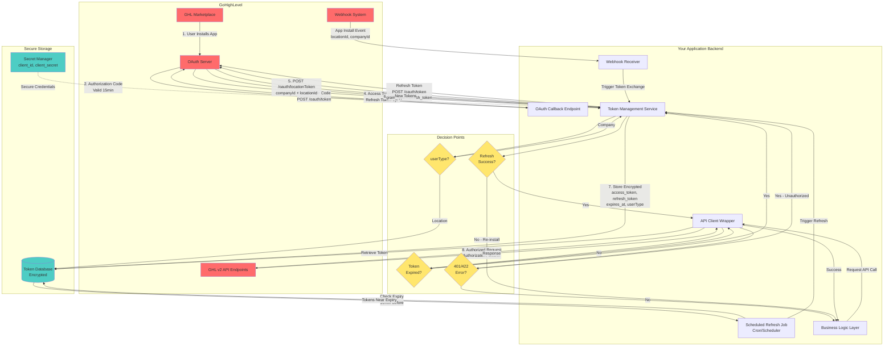
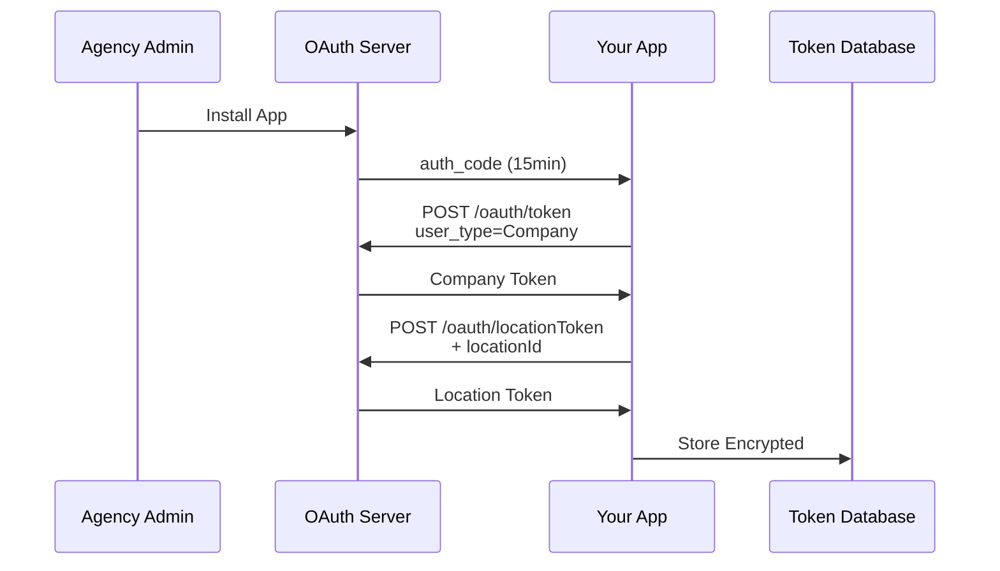

# GoHighLevel OAuth Token Management System

## Overview
Architecture diagram for managing GoHighLevel OAuth tokens, including installation flows, token exchange, refresh mechanisms, and API integration.

---

## System Architecture



---

## Installation Flow (Agency)



---

## Key Components

### 1. OAuth Callback
- Receives authorization code (15min validity)
- Exchanges for access + refresh tokens
- Stores securely in database

### 2. Webhook Receiver
- Receives App Install events
- Gets `locationId` and `companyId`
- Triggers location token exchange

### 3. Token Service
- Exchanges codes for tokens
- Converts Company → Location tokens
- Refreshes expired tokens
- Never logs sensitive data

### 4. API Wrapper
- Auto-injects tokens
- Auto-refresh on 401/422 errors
- Handles rate limiting

### 5. Scheduled Refresh Job
- Runs every 30 minutes
- Refreshes tokens before expiry
- Prevents service disruption

### 6. Token Database
```json
{
  "locationId": "string (PRIMARY KEY)",
  "companyId": "string",
  "access_token": "ENCRYPTED",
  "refresh_token": "ENCRYPTED",
  "expires_at": "timestamp",
  "userType": "Company | Location"
}
```

---

## API Specifications

### Token Lifetimes
- **Access Token:** 24 hours
- **Refresh Token:** 1 year (or until used)
- **Authorization Code:** 15 minutes

### Exchange Authorization Code
```
POST /oauth/token
Content-Type: application/x-www-form-urlencoded

client_id={YOUR_CLIENT_ID}
client_secret={YOUR_CLIENT_SECRET}
grant_type=authorization_code
code={AUTH_CODE}
user_type=Company|Location
redirect_uri={YOUR_REDIRECT_URI}
```

### Refresh Token
```
POST /oauth/token
Content-Type: application/x-www-form-urlencoded

client_id={YOUR_CLIENT_ID}
client_secret={YOUR_CLIENT_SECRET}
grant_type=refresh_token
refresh_token={REFRESH_TOKEN}
user_type=Company|Location
```

### Get Location Token
```
POST /oauth/locationToken
Authorization: Bearer {COMPANY_TOKEN}
Version: 2021-07-28

companyId={COMPANY_ID}
locationId={LOCATION_ID}
```

### Error Handling

| Code | Meaning | Action |
|------|---------|--------|
| 401 | Token expired | Refresh token |
| 422 | Invalid token | Refresh token |
| 400 | Bad request | Log & notify |
| 429 | Rate limit | Exponential backoff |

---

## Security Checklist

- ✅ AES-256 encryption at rest
- ✅ HTTPS only
- ✅ Tokens never in client-side code
- ✅ Tokens never logged
- ✅ Webhook signature verification
- ✅ Credentials in secret manager

---

## Implementation Checklist

### Setup
- [ ] Register app in GHL Marketplace
- [ ] Configure redirect URI & webhook URL
- [ ] Generate client_id and client_secret
- [ ] Define required scopes

### Core Components
- [ ] OAuth callback endpoint
- [ ] Webhook receiver endpoint
- [ ] Token Management Service
- [ ] Encrypted token database
- [ ] Secret manager setup

### API Integration
- [ ] API Client Wrapper
- [ ] Auto token injection
- [ ] Auto-refresh on errors
- [ ] Business logic integration

### Automation
- [ ] Scheduled refresh job (every 30min)
- [ ] Monitoring/alerting
- [ ] Logging (exclude tokens)

### Testing
- [ ] Agency installation flow
- [ ] Sub-account installation flow
- [ ] Token refresh mechanism
- [ ] Error handling (401/422)
- [ ] Security audit

---

## Installation Scenarios

| Aspect | Agency Install | Sub-account Install |
|--------|---------------|---------------------|
| **Who** | Agency admin | Sub-account user |
| **Token Type** | Company | Location |
| **Conversion** | Required | Not needed |
| **Use Case** | Multiple locations | Single location |

---

## Legend

- 🔴 Red: GHL Systems
- 🔵 Blue: Your Backend
- 🟢 Green: Secure Storage
- 🟡 Yellow: Decision Points

---

## Resources

- [GHL OAuth Docs](https://highlevel.stoplight.io/docs/integrations/00d0c0ecaa369-overview)
- [GHL API Reference](https://highlevel.stoplight.io/docs/integrations/)

---

## Document Info
- **Version:** 1.0
- **Last Updated:** 2025-11-17
- **Author:** Jzeff Kendrew F. Somera
- **Status:** Ready for Implementation
